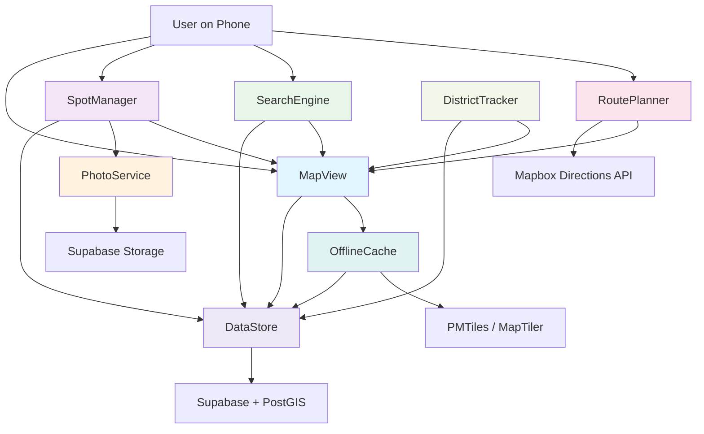

# Architectural Blueprint

## 1. Core Objective

Build a mobile-first PWA that serves as a personal city discovery journal for systematically exploring San Francisco district by district. Success means: the user can walk any SF district, quickly pin interesting spots with photos and notes, find nearby spots on a map, plan walking routes between them, and eventually share curated district guides — all working offline when signal is poor.

## 2. System Scope and Boundaries

### In Scope
- Interactive map with spot pins, user location, and district boundaries
- Spot CRUD: create, view, edit, delete spots with metadata (name, category, rating, notes, photos, coordinates, district)
- Photo capture and upload from phone camera
- Search and filter spots by district, category, rating, proximity
- Walking route planning between selected spots
- Offline map browsing and spot viewing
- District progress tracking (visited vs. unvisited)
- PWA installable on phone home screen
- Single-user tool (personal use)

### Out of Scope
- Multi-user accounts or social features (Phase 1 is personal only)
- Native mobile app (PWA covers mobile needs)
- Real-time collaboration or live sharing
- Business listings, reviews aggregation, or third-party data import
- Monetization, ads, or paid features
- Backend server (serverless via Supabase + Cloudflare)
- Custom tile hosting (use MapTiler free tier)

## 3. Core System Components

| Component Name | Single Responsibility |
|---|---|
| **MapView** | Renders the interactive map with spot markers, user location, district boundaries, and route overlays |
| **SpotManager** | Handles all spot CRUD operations — creating, reading, updating, deleting spots with their full metadata |
| **PhotoService** | Captures photos from camera, uploads to Supabase Storage, retrieves public URLs for display |
| **SearchEngine** | Filters and queries spots by district, category, rating, text, and geographic proximity |
| **RoutePlanner** | Calculates walking routes between selected spots and displays them on the map |
| **DistrictTracker** | Tracks exploration progress per district — visited status, spot count, coverage stats |
| **OfflineCache** | Manages service worker, caches map tiles, syncs spot data to IndexedDB for offline access |
| **DataStore** | Interfaces with Supabase (PostGIS) for persistent storage — spots table, spatial queries, auth |

## 4. High-Level Data Flow

## 5. Key Integration Points

- **MapView <-> DataStore**: Supabase JS client fetches spot GeoJSON; MapView renders as MapLibre GL JS markers/layers
- **MapView <-> OfflineCache**: Service worker intercepts tile requests; PMTiles serve cached vector tiles from IndexedDB when offline
- **SpotManager <-> DataStore**: Supabase `INSERT/UPDATE/DELETE` on `spots` table with PostGIS `GEOGRAPHY(POINT)` column
- **SpotManager <-> PhotoService**: After photo capture, PhotoService uploads to Supabase Storage and returns public URL; SpotManager stores URL in spot record
- **PhotoService <-> Supabase Storage**: Upload via Supabase JS SDK to `spot-photos` bucket; serve via public CDN URL
- **SearchEngine <-> DataStore**: PostGIS spatial queries — `ST_DWithin()` for radius search, `<->` for nearest-neighbor, plus standard SQL filters
- **RoutePlanner <-> Mapbox Directions API**: REST API call with waypoints (lat/lng pairs), returns GeoJSON polyline for walking route
- **RoutePlanner <-> MapView**: GeoJSON route line rendered as MapLibre GL JS layer overlay
- **OfflineCache <-> DataStore**: On app load and periodically, sync spots from Supabase to IndexedDB; serve from IndexedDB when offline
- **Authentication**: Supabase Auth (magic link or OAuth) — single user, but needed for Row-Level Security on database
- **Data Format**: GeoJSON for all spatial data exchange between components; JSON for non-spatial API responses
